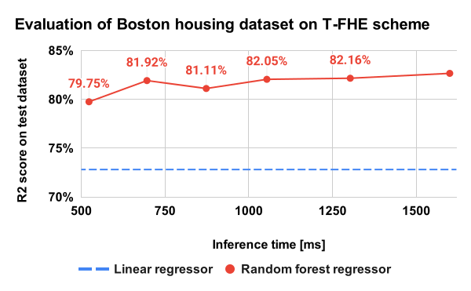
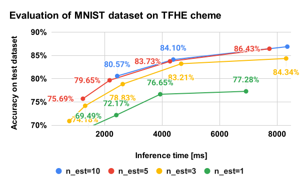
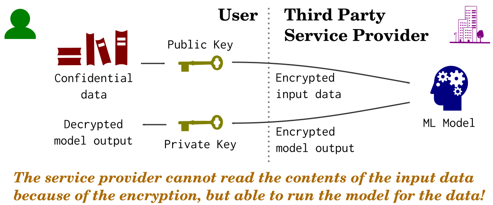

Binary Random Forest on the T-FHE Scheme
================================================================================

This repository proposes and implements a binary random forest
regressor/classifier on the T-FHE (Torus Homomorphic Encryption) scheme [1].
Features of our binary random forest are:

- able to run inference on the T-FHE scheme [1]. In other words, our model
  requires only encrypted input in inference. The private key is required only
  when the user want to know the contents of the inference result.
- have a good accuracy-speed tradeoff than the other FHE-based ML models,
  like linear regression.
- able to accelerate inference by GPU because we are using
  [cuFHE](https://github.com/vernamlab/cuFHE) library [2] as a backend.

One of the common regressors/classifiers used on the FHE (Fully Homomorphic
Encription) scheme is a linear model because it has a reasonable inference
time (in other words, other method is very slow for casual use), however,
it has a limitation in model flexibility. Our binary random forest model
has a capability to solve this issue. We also tried our binary random forest
on the Boston houseing dataset and MNIST dataset as a benchmark.


What's binary random forest?
--------------------------------------------------------------------------------

The binary random forest is a random forest where input data is a binary
vector. We found that the binary random forest is convenient to run on the
T-FHE scheme. The core idea is that the branch conditions can be written as
binary operators if the input vector is binary
as written in the following figure.

<div align="center">
  
</div>

### Pros and cons

- **Pros**: It has a good speed-accuracy tradeoff while most of the ML methods on
  FHE scheme require huge computational cost.
- **Pros**: It can manage any types of binary input like like quantized real
  valued vector and thresholded image.
- **Cons**: computational cost of it linearly increase against the number of
  estimators, and exponentially increase against the maximum depth of the decision
  trees. This is because the model cannot know which branch is selected in
  a decision tree since the input data is encrypted, therefore, the model need
  to compute branching condition for all nodes in a tree.


Installation
--------------------------------------------------------------------------------

### Creating Docker container

The authors highly recommend using [Docker](https://www.docker.com/) to build
the environment for this repository while keeping your environment clean.

You can download the Docker image and start a container by the following
command in the root directory of this repository:

```console
sh docker/docker_run.sh
docker exec -it cufhe bash
```

### Building cuFHE library

Our implementation uses [cuFHE](https://github.com/vernamlab/cuFHE) library [2]
which provides CUDA-accelerated T-FHE binary operations.

Please run the following command in the root directory of this repository
for preparing the cuFHE library.

```console
git clone https://github.com/vernamlab/cuFHE.git
cd cuFHE/
git checkout 1af2f2be596e66fcc14f5659d8a89432fe53d41f
```

**NOTE**: In the above, we selected `1af2f2be596e66fcc14f5659d8a89432fe53d41f`
which is the latest commit as of Jan 2022 because we used this version
for the development of our repository, however, newer is probably better
if available.

Then, run the following command for building the cuFHE library:

```console
cd cuFHE/cufhe/
make
```

The cuFHE shared object files (`libcufhe_cpu.so`, `libcufhe_gpu.so`) will be
generated under `cuFHE/cufhe/bin` directory. The cuFHElibaraly is successfully
built on your environment if you can see these 2 files.


Usage
--------------------------------------------------------------------------------

### Regressoin

You can try the training and inference of the binary random forest to the
Boston housing dataset on the T-FHE scheme with `max_depth=5` and
`n_estimators=10` by the following command:

```console
cd regression/
make
```

The following figure is a summary of our binary random forest regressor
with comparison to linear regressor. The linear regressor is one of
commonly used algorithm as a regressor on FHE scheme (in most cases
CKKS scheme will be used). The figure shows that our binary random
forest achieves better performance than linear regressor
with reasonable inference time.

You can replicate our experiment by running `bash runall.bash`.

<div align="center">
  
</div>

See [regression/README.md](regression/README.md) for more details.

### Classification

You can try the training and inference of the binary random forest to
MNIST dataset on the T-FHE scheme with `max_depth=5` and
`n_estimators=10` by the following command:

```console
cd classification/
make
```

The following figure is a summary of our binary random forest classifier
on MNIST dataset. The figure shows that our binary random
forest is applicable to MNIST, but the performance is far from
our expectation (we expected more than 90% within 10.0 sec).

You can replicate our experiment by running `bash runall.bash`.

<div align="center">
  
</div>

See [classification/README.md](classification/README.md) for more details.


Notes
--------------------------------------------------------------------------------

- This repository contains symbolic links which does not work on Windows
  environment. Please replace them to appripriate files after cloning this
  repository if you are using Windows.


Gratitude
--------------------------------------------------------------------------------

* We are deeply grateful to the authors of the
  [cuFHE](https://github.com/vernamlab/cuFHE) library because our
  implementation highly depends on the cuFHE library.


Appendices
--------------------------------------------------------------------------------

### Appendix A: Why HE-based ML models are important?

From a business standpoint, HE-based ML models (ML models on HE scheme)
enables us to delegate ML algorithm work to a third party computing service
while preserving the security of the data.

Let's assume that you have some condidential data and want to apply your data
to some ML model which is provided by some third party service provider.
If the ML model is a HE-based ML model, you can execute the model on
the service provider's server without publishing the data to the service
provider. Input to the ML model is encrypted data, and the returned values
from the sevice provider is encrypted output that can be decrypt using your
private key. See the following figure.

<div align="center">
  
</div>

### Appendix B: What's Homomorphic Encription?

Homomorphic encryption (HE) is a class of encryption algorithms that allows
operations (additions, multiplications, etc) on encrypted space without access
to a secret key. For example, let `p1` and `p2` be plain texts (data before
encryption) and `c1` and `c2` be corresponding cipher texts respectively.
The HE provides a function `F` which satisfies `Decrypt(F(c1, c2)) = p1 + p2`.

<div align="center">
  
</div>

HE algorithm can be classified to several types of encryption schemes that
can perform different classes of computations under different limitations.
Some common types of homomorphic encryption schemes are listed below:

- **Partially homomorphic encryption**: it supports only one type of operation
  like addition or multiplication
- **Somewhat homomorphic encryption**: it supports arbitral operations  but has
  some limitation
- **Leveled fully homomorphic encryption**: it supports arbitral operations
  but the number of operations is bounded (subset of somewhat HE)
- **Fully homomorphic encryption**: it allows arbitral operations with
  arbitrary number of times (the strongest notion of HE)

Note that the support of arbitral function is achieved by supporting,
sum and multuplication, or sometimes, NAND.

The FHE envisioned in 1970s, and first constructed by Craig Gentry in 2009.
The torus homomorphic encryption (T-FHE), proposed by Chillotti _et al_ in 2016,
is a variant of fully homomorphic encription (FHE) that focus on the binary
operations and realized quite fast bootstrapping. Well-explained history of
HE is available in
[Wikipedia](https://en.wikipedia.org/wiki/Homomorphic_encryption).


References
--------------------------------------------------------------------------------

[1] I. Chillotti, N. Gama, M. Georgieva, and M. Izabachene,
    "TFHE: Fast Fully Homomorphic Encryption Over the Torus",
    Journal of Cryptology, 2019.
    [URL](https://www.iacr.org/cryptodb/data/paper.php?pubkey=29498)

[2] [vernamlab/cuFHE](https://github.com/vernamlab/cuFHE)

[3] C. Gentry,
    "Fully homomorphic encryption using ideal lattices",
    Proc of the forty-first annual ACM symposium on Theory of computing, 2009.
    [URL](https://www.cs.cmu.edu/~odonnell/hits09/gentry-homomorphic-encryption.pdf)

[4] I. Chillotti, N. Gama, M. Georgieva, and M. Izabachene,
    "Faster fully homomorphic encryption: Bootstrapping in less than 0.1 seconds",
    Asiacrypt, 2016.
    [URL](https://eprint.iacr.org/2016/870)
