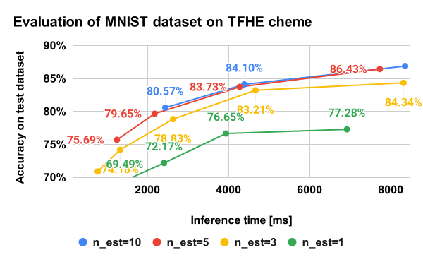

Classification using Binary Random Forest
================================================================================

This directory contains code for binary random forest classifier and
experiments on the MNIST dataset.


Usage
--------------------------------------------------------------------------------

You can train and test the binary random forest model on the MNIST dataset
by the following command in this directory:

```console
make
```

Implementation details
--------------------------------------------------------------------------------

TBD. See the [README for regression code](../regression/README.md) for now
because the implementation policy is almost the same as the regression code.


Evaluation on MNIST
--------------------------------------------------------------------------------

We have tried our binary random forest on the MNIST dataset which is a famouse
dataset for an image classification task. We've created the input binary vector
by applying thresholding to the image and flatten it.

The following figure is a summary of our binary random forest classifier on
the MNIST dataset. The figure shows that our binary random forest is applicable
to MNIST, however, the score is far from our expectation (we expected more than
90% within 10.0 sec inference time).

You can replicate our experiments by running `bash runall.bash`.

<p align="center">
  
</p>
